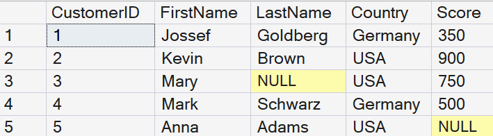
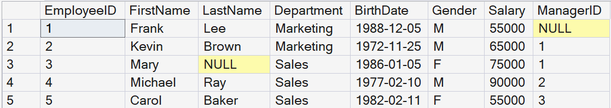
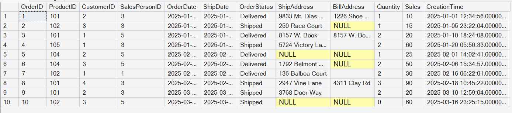
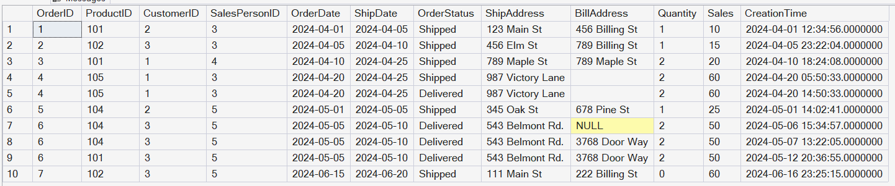

# 🚀 SQL LEARNING

## 📌 About  
This repository contains my SQL practice using a real-world sales dataset.

---

## 🧠 Tables Used  

- Customers  
- Employees  
- Orders  
- OrdersArchive  

---

## 📊 Tables Preview  

### Customers  

### Employees  

### Orders  

### Orders Archive  

---

## 📅 Progress  

- Day 1 ✅  
- Day 2 ✅ 
- Day 3 ⏳ 

---

## ⚙️ Tools Used  

- Microsoft SQL Server  
- VS Code  
- GitHub  